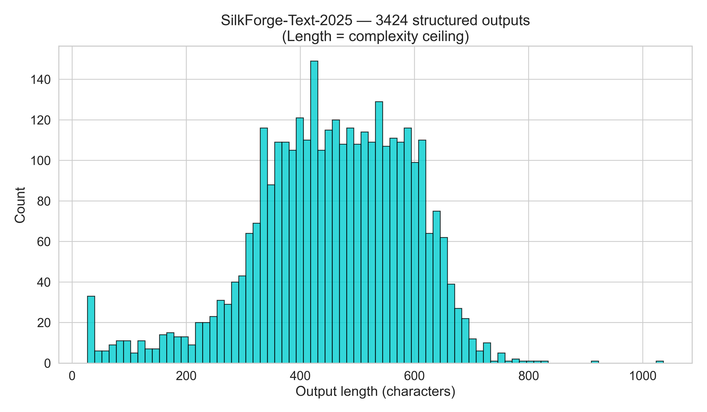

# SilkForge-Text-2025 — Safe, Domain‑Agnostic Generative Template

[](https://www.python.org/)
[](#)
[](https://wandb.ai/)

A production-grade, domain-agnostic generative sampling template that produces generic structured text (JSON). Built for clarity, scale, and saleability — with zero domain-specific content.

## TL;DR
- One command to generate tens of thousands of JSON samples
- Resumable runs, rank-safe indexing, atomic writes
- Optional JSONL sharding and W&B logging
- Plug-and-play custom generators

## Features
- Distributed-safe sampling (rank-aware indexing, barriers, resumable runs)
- Per-sample JSON saves (atomic) and optional JSONL sharding (rank-safe)
- Seed control and optional mixed precision
- Rank-0 W&B logging with graceful fallback
- Pluggable generator interface (`--custom-generator`, `--generator-class`)
- Clean CLI and repeatable runs

## Quickstart (single process)
```bash
python3 -m venv .venv
. .venv/bin/activate
pip install --upgrade pip
pip install torch torchvision torchaudio --index-url https://download.pytorch.org/whl/cpu
pip install transformers tqdm wandb matplotlib seaborn

python safe_generative_template_2025.py \
  --total-samples 10000 \
  --batch-size 16 \
  --output-dir ./silkforge_results_text \
  --wandb-project Safe-Generative-Template \
  --hf-model gpt2 \
  --prompt "Generic structured content:" \
  --max-new-tokens 128 \
  --temperature 0.9 \
  --enable-jsonl-shards --shard-size 5000
```

## Custom Generator Plugin (optional)
Use your own generator safely (must return `List[str]`):
```bash
python safe_generative_template_2025.py \
  --total-samples 5000 \
  --batch-size 16 \
  --output-dir ./silkforge_results_plugin \
  --custom-generator ./custom_text_generator.py \
  --generator-class CustomGenerator
```

See `custom_text_generator.py` for a simple example.

## Post-Run Utilities
- Top 20 longest outputs (no external tools required):
```bash
python - <<'PY'
import json, glob
files = sorted(glob.glob('silkforge_results_text/*.json'))
items = sorted(((len(json.load(open(f))['content']), f) for f in files), reverse=True)[:20]
open('TOP_20_LONGEST.txt','w').write('\\n'.join(f'{i+1}. {Path(f).stem} | {l} chars' for i,(l,f) in enumerate(items)))
print('Wrote TOP_20_LONGEST.txt')
PY
```
- Length histogram:
```bash
python - <<'PY'
import matplotlib; matplotlib.use('Agg')
import matplotlib.pyplot as plt, json, glob, seaborn as sns
sns.set(style='whitegrid', font_scale=1.4)
files = glob.glob('silkforge_results_text/*.json')
lengths = [len(json.load(open(f))['content']) for f in files]
plt.figure(figsize=(12,7))
plt.hist(lengths, bins=80, color='#00CED1', edgecolor='black', alpha=0.8)
plt.title('Safe Generative Template — Length Distribution', fontsize=18)
plt.xlabel('Output length (characters)')
plt.ylabel('Count')
plt.tight_layout()
plt.savefig('silkforge_text_histogram.png', dpi=400, facecolor='white')
print('Saved silkforge_text_histogram.png')
PY
```

## Outputs
- Individual JSON files in the output directory
- Optional JSONL shards in `<output>/shards/` (rank-safe rotation)
- Example distribution:



## Distributed (optional)
```bash
torchrun --nproc_per_node=4 safe_generative_template_2025.py \
  --total-samples 20000 \
  --batch-size 16 \
  --output-dir ./silkforge_results_text_ddp
```

## Repo Hygiene
- Outputs are git-ignored by default (`.gitignore`)
- Use `--resume` to continue a partial run
- Checkpoints saved every 5k samples (`checkpoint.json`)

## What You Get
- Clean, documented generator code
- Reproducible sampling pipeline
- Ready-made artifacts (Top‑20 list, histogram)
- Plugin interface to drop in your own generator

## FAQ
- Does this require GPUs? No — CPU-only works; GPUs are supported if available.
- Is W&B required? No — logging is optional and rank‑aware.
- Can I bring my own generator? Yes — see `--custom-generator` and `--generator-class`.

## License
Add your preferred license (MIT/Apache-2.0/etc.).

—
Maintained by `SilkForgeAi` on GitHub. Visit the org profile: https://github.com/SilkForgeAi

